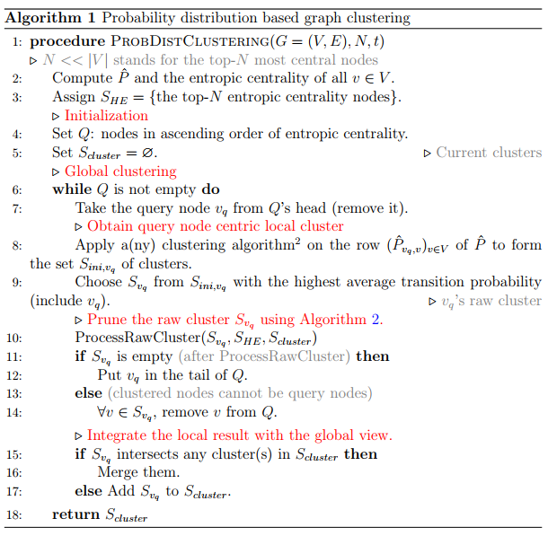
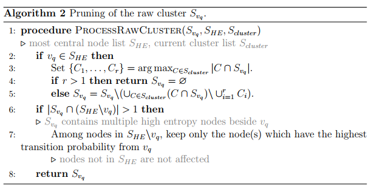

# A Modular Framework for Centrality and Clustering in Complex Networks
  
We consider the generalized setting of directed weighted graphs, such that
any undirected graph and/or unweighted graph can be treated as special cases.
We adhere to the definition of entropic centrality, which treats a node as central if
there is a high uncertainty about the destination of a random walker starting its
walk at the given node, where however a suitable probability to choose a given edge
by a random walker is introduced in order to capture the weights of outgoing edges,
with the further possibility to also assign an intrinsic initial weight (importance)
to nodes based on its weight cumulated out-degree.

## To install libraries
        pip install -r requirements.txt